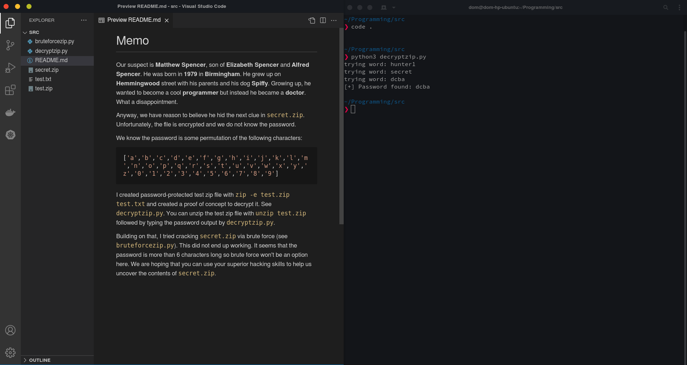

# Escape Room Hack Challenge

> A hacking challenge for use in an escape room target at progrmmers

The `src/` folder contains a hacking challenge (with its own README). It is intended to be one of many puzzles in an escape room.

Solving the challenge doesn't require much coding - It's more about reading the [`README`](./src/README.md) and solving the puzzle by modifying the provided code.
An internet connection is not needed to solve this puzzle.

## Setup Instructions

If you're looking to give this challenge to someone, follow these instructions to set it up.

1. Copy the `src/` folder to the desktop. Open a terminal in that folder.
2. In the copied `src/` folder, add a file called `secret.txt`.
3. In `secret.txt`, write your next clue (eg. _The vault's passcode is 8369_).
4. Generate a password-encrypted zip archive containing the secret.txt file: `zip -e secret.zip secret.txt`.
    - This will ask you to enter a password. Make that password a combination of 5 of the bolded words in the [`README`](./src/README.md) (eg. `spiffy1979spencerhemmingwooddoctor`).
    - You can verify it works with `unzip secret.zip` and entering the password.
5. Delete `secret.txt`: `rm secret.txt`.
6. Open the `src/` folder in an editor (eg. VS Code) and leave it open on the [`README`](./src/README.md) file.
7. Open a terminal and run `python3 decryptzip.py`.
    Example setup:
    

## License

This project is licensed under the MIT License - see the [LICENSE](./LICENSE) file for details.
